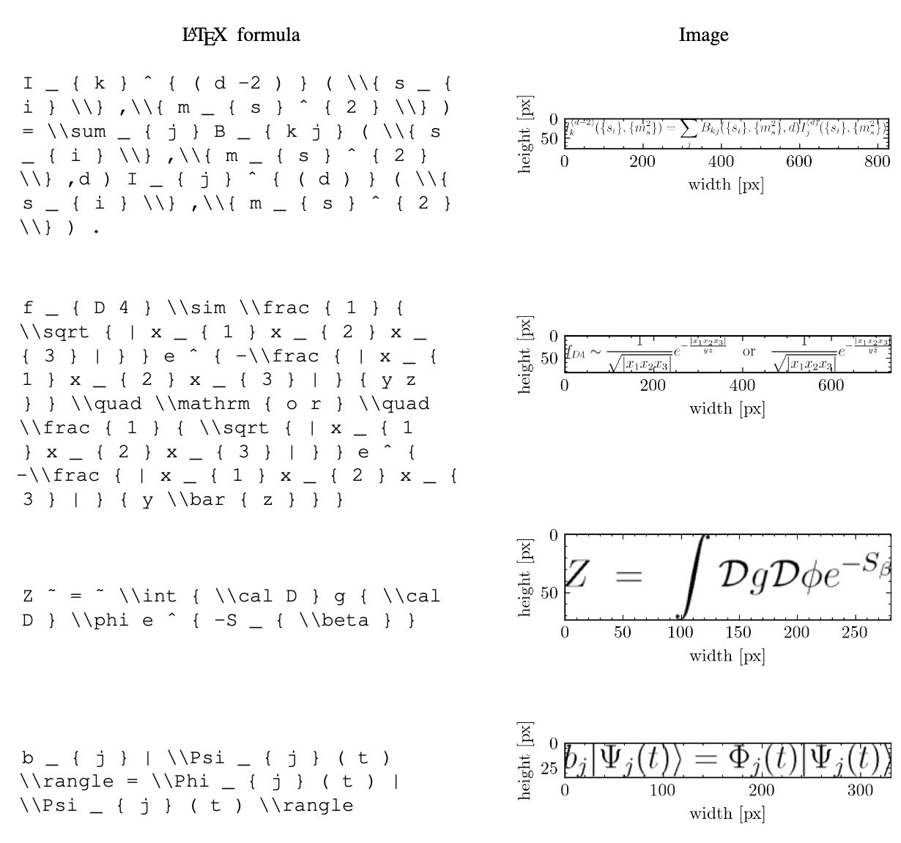
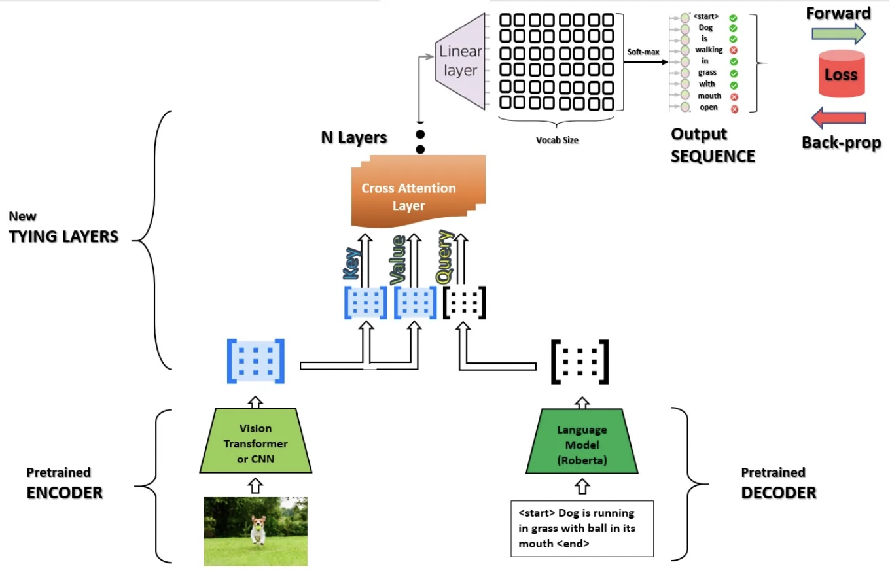

# Image to LaTeX with attention

## Problem Description
LaTeX is a software system for document preparation. It is widely used in academia for the communication and publication of scientific documents in many fields. But preparation materials using LaTeX requires from the writer a lot of time and effort. So, the problem of image-to-markup generation is solved in this work. Images with formula are translated to LATEX code. The proposed model is based on the Vision Encoder Decoder architecture.

## Dataset Description
We use the following publicly available [I2L-140K dataset](TBA) for image to LaTeX problem.

I2L-140K dataset is a collection of images of LaTeX formulas and LaTeX formulas themselves. Some samples from
dataset are presented below. Dataset contains a total of 154,944 images and LaTeX formulas. LaTeX formulas
length is varied from 1 to 2177 symbols. Each image in the dataset is a 1-channel image with a resolution that depends on the length of the formula and varies from 3 × 3 pixels to 1020 × 644 pixels.

    

## Model architecture
Our task requires both Natural Language Processing as well as Computer Vision. Then, we decided to use the Vision Encoder Decoder Model. It initializes an image-to-text model with any pre-trained Transformer-based vision model as the encoder (e.g. ViT, BEiT, DeiT, Swin) and any pre-trained language model as the decoder (e.g. RoBERTa, GPT2, BERT, DistilBERT). The encoder model is used to encode the image, after which an autoregressive language model i.e. the decoder model generates the formula markup.

    

## Code Reproducibility

## Experiments and Results

## Report
The full report of the project is avaible here [link to the report](TBA)

## Summary
In this work a neural transducer model with visual attention is presented. It learns to generate
\LaTeX\: markup of a real-world math formula given its image. Applying sequence modeling and transduction techniques that have been very successful across modalities such as natural language, image, handwriting, speech and audio; we construct
an image-to-markup model that learns to produce syntactically and semantically correct \LaTeX\: markup code.

As future objectives we considers experimenting with different encoder and decoder models in Vision Encoder Decoder architecture. Also we are planning to launch a convenient service for image to \LaTeX\: markup translation for our end user audience.
