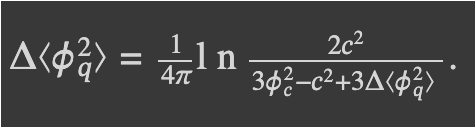

# Image to $\LaTeX\:$

  
Table of Contents

  <ol>
    <li>
      <a href="#problem-description">Problem description</a>
    </li>
     <li><a href="#dataset-description">Dataset description</a></li>
    <li>
      <a href="#model-architecture">Model architecture</a>
    <li>
      <a href="#code-reproducibility">Code reproducibility</a>
    <li>
      <a href="#experiments-and-results">Experiments and Results</a>
    <li>
      <a href="#paper-and-presentation">Paper and Presentation</a>
    <li>
      <a href="#summary">Summary</a>
    <li>
      <a href="#license">License</a>
    </li>
  </ol>

## Problem Description
$\LaTeX\:$ is a software system for document preparation. It is widely used in academia for the communication and publication of scientific documents in many fields. But preparation materials using $\LaTeX\:$ requires from the writer a lot of time and effort. So, the problem of image-to-markup generation is solved in this work. Images with formula are translated to $\LaTeX\:$ code. The proposed model is based on the Vision Encoder Decoder architecture.

## Dataset Description
We use the following publicly available [I2L-140K dataset](https://untrix.github.io/i2l/140k_download.html) for image to $\LaTeX\:$ problem.

I2L-140K dataset is a collection of images of $\LaTeX\:$ formulas and $\LaTeX\:$ formulas themselves. Some samples from
dataset are presented below. Dataset contains a total of $154,944$ images and $\LaTeX\:$ formulas. $\LaTeX\:$ formulas
length is varied from $1$ to $2177$ symbols. Each image in the dataset is a 1-channel image with a resolution that depends on the length of the formula and varies from $3 \times 3$ pixels to $1020 \times 644$ pixels.

    

## Model architecture
Our task requires both Natural Language Processing as well as Computer Vision. Then, we decided to use the Vision Encoder Decoder Model. It initializes an image-to-text model with any pre-trained Transformer-based vision model as the encoder (e.g. ViT, BEiT, DeiT, Swin) and any pre-trained language model as the decoder (e.g. RoBERTa, GPT2, BERT, DistilBERT). The encoder model is used to encode the image, after which an autoregressive language model i.e. the decoder model generates the formula markup.

    

## Code Reproducibility
All necessary Jupyter notebooks are provided in [src](./src) directory.

## Experiments and Results
In this experiment, we utilized two encoder architecture variants:
ViT Encoder and CNN Encoder. 

In ViT Encoder approach the image was divided into patches of size $16 \times 16$ pixels. After passing through the encoder, we obtained the output embeddings of shape $(N, (H / {patch\_size})^2, {embed\_size})$.
The second encoder used was CNN Encoder (ResNet101). We employed a pretrained model and only modified the first convolutional layer to accommodate the single-channel input image. We also removed the dense layers at the end and added a final convolutional layer to adjust the embedding dimension.

During training procedure the following optimizers were used: Adam and Adamax. We tested different batch sizes: $16, 32$, and $64$. The learning rate used was $1e-4$.

Next metrics were used:
BLEU, ROUGE-1 Precision, ROUGE-1 F-Measure, ROUGE-1 Recall, 
ROUGE-2 Precision, ROUGE-2 F-Measure, ROUGE-2 Recall, 
ROUGE-L Precision, ROUGE-L F-Measure, ROUGE-L Recall. 

During experiments subset of $50, 500$ $\LaTeX\:$ formulas with ViT decoder architecture was used. However, overfitting took place as expected.

In the next iteration CNN decoder on the full dataset was implemented, still statistically significant result was not achieved. 

Finally, ViT decoder gave the best performance, it was used in testing procedure.

    

ROUGE metrics evaluation on testing procedure

    

    #1 predicted formula

    

    #1 target formula

    

    #2 predicted formula

    

    #2 target formula

    

    #3 predicted formula

    

    #3 target formula

    

    #4 predicted formula

    

    #4 target formula

    

    #5 predicted formula

    

    #6 target formula

    

    #6 predicted formula

    

    #6 target formula

Examples of target and predicted formulas

## Paper and Presentation
Image to $\LaTeX\:$ final project defence in deep learning course (25 May 2023, Eng, [slides](./presentation/ImgToLaTeX_presentation.pdf), [paper](./paper/ImgToLaTeX_paper.pdf))

## Summary
In this work a neural transducer model with visual attention is presented. It learns to generate
$\LaTeX\:$ markup of a real-world math formula given its image. Applying sequence modeling and transduction techniques that have been very successful across modalities such as natural language, image, handwriting, speech and audio; we construct
an image-to-markup model that learns to produce syntactically and semantically correct $\LaTeX\:$ markup code.

As future objectives we considers experimenting with different encoder and decoder models in Vision Encoder Decoder architecture. Also we are planning to launch a convenient service for image to $\LaTeX\:$ markup translation for our end user audience.

## License
MIT License

Copyright (c) 2023 Antonina Kurduykova, Dmitrii Baluev, Matvey Skripkin, Nikolay Kalmykov, Nikita Ligostaev

Permission is hereby granted, free of charge, to any person obtaining a copy
of this software and associated documentation files (the "Software"), to deal
in the Software without restriction, including without limitation the rights
to use, copy, modify, merge, publish, distribute, sublicense, and/or sell
copies of the Software, and to permit persons to whom the Software is
furnished to do so, subject to the following conditions:

The above copyright notice and this permission notice shall be included in all
copies or substantial portions of the Software.

THE SOFTWARE IS PROVIDED "AS IS", WITHOUT WARRANTY OF ANY KIND, EXPRESS OR
IMPLIED, INCLUDING BUT NOT LIMITED TO THE WARRANTIES OF MERCHANTABILITY,
FITNESS FOR A PARTICULAR PURPOSE AND NONINFRINGEMENT. IN NO EVENT SHALL THE
AUTHORS OR COPYRIGHT HOLDERS BE LIABLE FOR ANY CLAIM, DAMAGES OR OTHER
LIABILITY, WHETHER IN AN ACTION OF CONTRACT, TORT OR OTHERWISE, ARISING FROM,
OUT OF OR IN CONNECTION WITH THE SOFTWARE OR THE USE OR OTHER DEALINGS IN THE
SOFTWARE.
